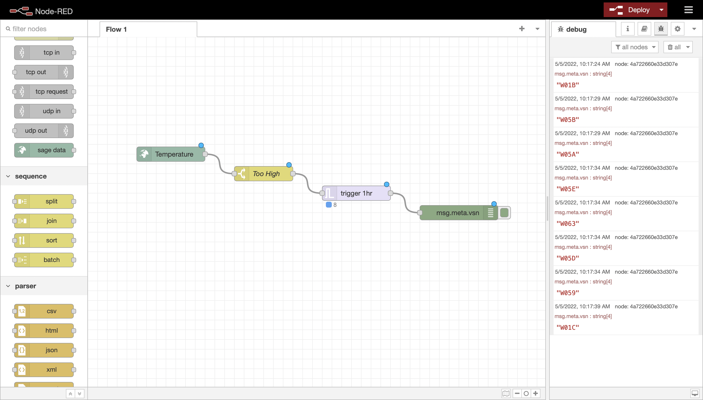

# Sage Data Node

This NodeRED simplifies the integration of Sage data into NodeRED flows by watching and
sending measurements from the Sage Data API.

The node can be configured with a standard query filter. For more general information about
data queries, see the [docs](https://docs.sagecontinuum.org/docs/tutorials/accessing-data).

Here's a screenshot of a simple temperature monitoring example in action:

